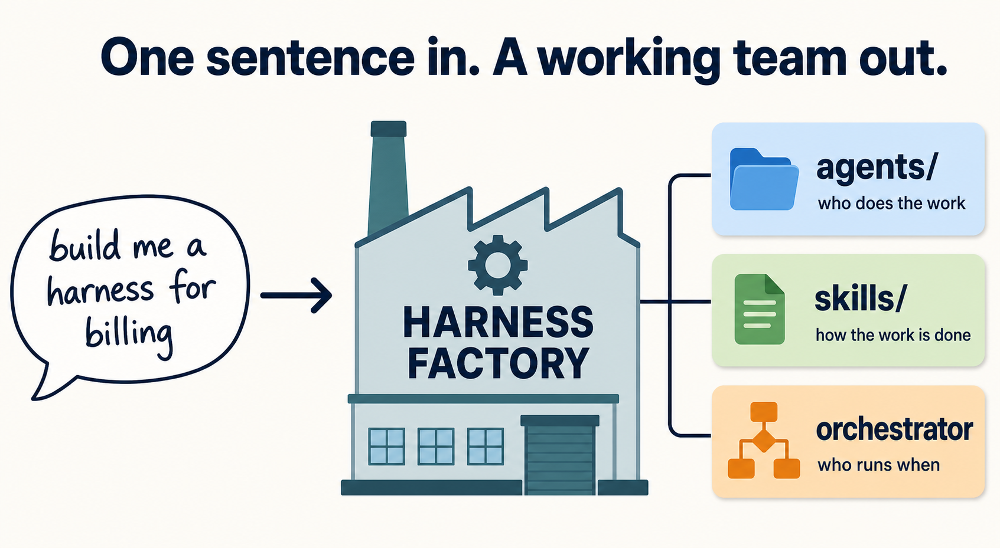
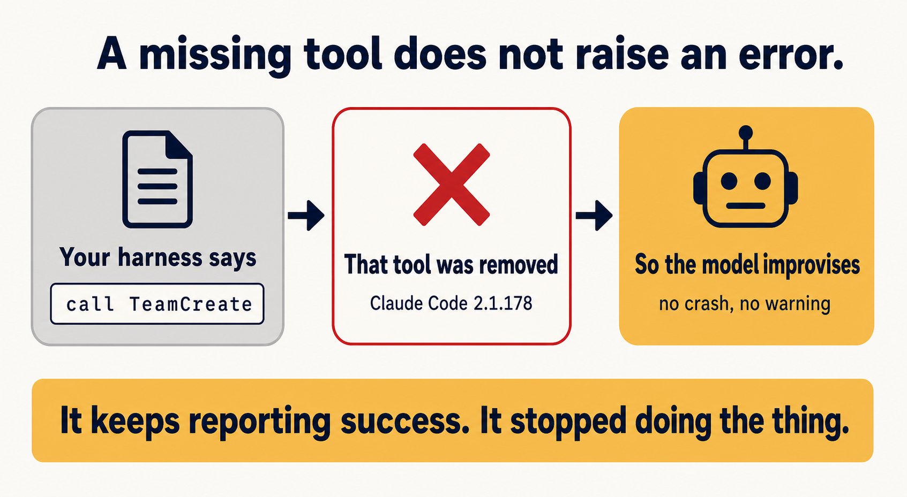
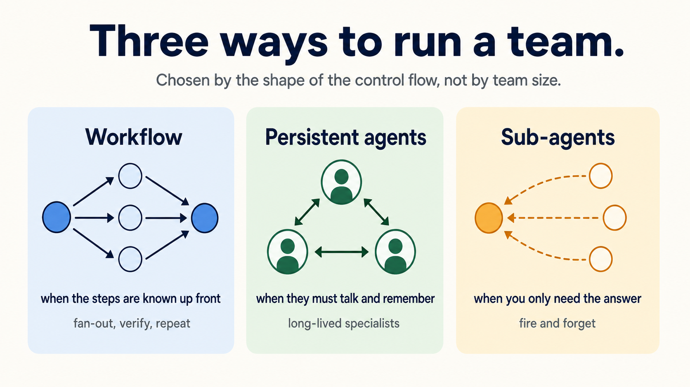
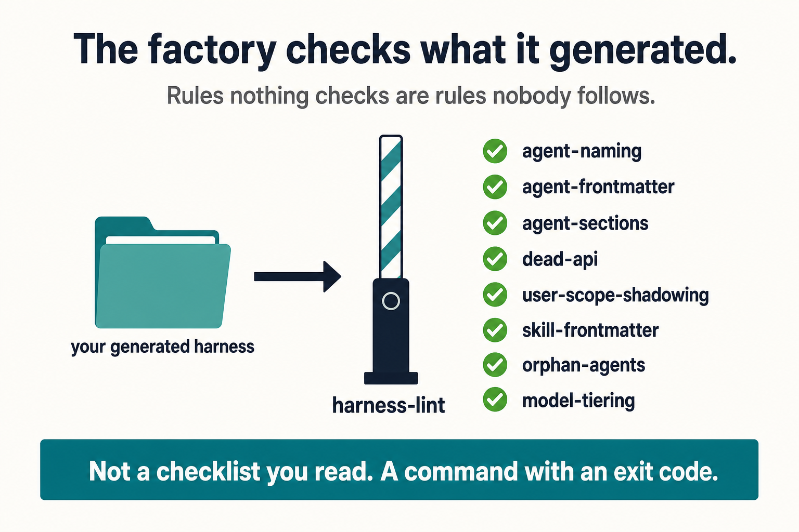
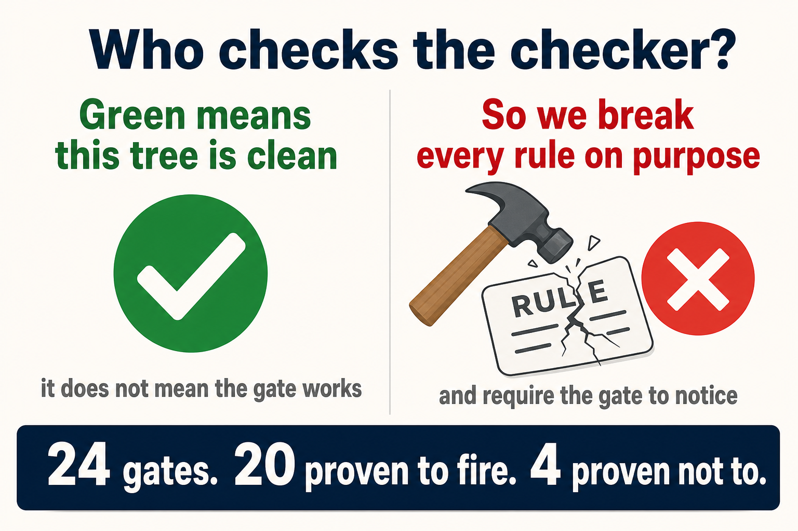

<!-- Modified from revfactory/harness (Apache-2.0, Copyright 2025 robin): rebranded,
     attribution block added, install target retargeted. -->

<p align="center">
  
  <a href="LICENSE"></a>
  
  
  
</p>

# oh-my-harness — Claude Code를 위한 팀 아키텍처 팩토리

[English](README.md) | **한국어** | [日本語](README_JA.md)

> **oh-my-harness는 Claude Code용 팀 아키텍처 팩토리입니다.** **"하네스 구성해줘"** 한 문장으로, 플러그인이 도메인 설명을 에이전트 팀과 그들이 쓸 스킬로 변환합니다.

> ### 출처 및 귀속
> `oh-my-harness` 는 [robin (Minho Hwang)](https://github.com/revfactory) 님의
> [revfactory/harness](https://github.com/revfactory/harness) 를 Apache-2.0 하에 이어받아
> **유지보수하는 파생본**입니다.
>
> 원저자는 훌륭한 v2 재구축을 작성했지만 2026-07-20 이후 머지되지 못한 채
> (머지 충돌 + `maintainerCanModify=false`) 남아 있고, 그래서 배포된 `main` 은
> 제거된 `TeamCreate` API 에 의존하는 v1 에 머물러 있습니다. 이 레포는 그 v2 작업과,
> 검토 후 채택한 커뮤니티 PR, 그리고 문서가 거짓말하지 못하게 막는 CI 를 함께 담았습니다.
>
> 전체 크레딧은 [NOTICE](./NOTICE) 와 [docs/ATTRIBUTION.md](./docs/ATTRIBUTION.md) 를 보세요.
> `harness` / `evolve` **스킬 이름은 그대로 유지**했습니다 — 익숙한 트리거 문구와
> v1 마이그레이션 경로가 계속 동작하도록.


<p align="center">
  
</p>

## v2에서 달라진 것

v2는 현행 Claude Code 멀티에이전트 런타임에 맞춰 바닥부터 재구축했습니다:

- **3중 네이티브 실행 모드.** v1은 이제 존재하지 않는 실험적 `TeamCreate` API 위에 지어져 있었습니다. v2는 실제로 출시된 프리미티브를 대상으로 합니다:
  1. **워크플로우 오케스트레이션** — 결정적 스크립트(`pipeline()` / `parallel()` / 스키마 / 버짓)로 팬아웃·검증 루프·대규모 실행
  2. **퍼시스턴트 에이전트 협업** — 이름 붙인 에이전트 + `SendMessage` + 공유 태스크, 턴을 넘어 컨텍스트 유지
  3. **서브에이전트 위임** — 경량 단발 병렬 호출
- **워크플로우 네이티브 품질 패턴.** 적대적 검증, 심판 패널, loop-until-dry, 다각 스윕, 완전성 비평가 — 생성된 하네스가 "그럴듯하지만 틀린" 산출물을 걸러내도록 체계화.
- **실험 플래그 완전 제거.** `CLAUDE_CODE_EXPERIMENTAL_AGENT_TEAMS=1` 의존성이 사라졌습니다.
- **합리적 모델 정책.** v1은 모든 에이전트를 `model: "opus"`로 고정했습니다. v2는 업무의 복잡도·작업 기간·자율성·응답 속도에 따라 에이전트별로 opus/sonnet 티어를 선택하며, 무근거 일괄 지정을 금지합니다.
- **`/oh-my-harness:evolve` 실제 출시.** v1이 문서로만 약속했던 진화 메커니즘이 실제 스킬로 제공됩니다: 초기 구성과 현재 상태의 델타를 포착하고, 피드백을 일반화하여 에이전트·스킬·오케스트레이터에 되먹입니다.
- **v1 마이그레이션 내장.** 팩토리가 v1 산출물(`TeamCreate`, `TeamDelete`, 실험 플래그)을 감지하면 기계적 마이그레이션 경로를 제안합니다.


<p align="center">
  
</p>

## 핵심 기능

- **에이전트 팀 설계** — 6가지 아키텍처 패턴(파이프라인, 팬아웃/팬인, 전문가 풀, 생성-검증, 감독자, 계층적 위임), 각 패턴에 최적 실행 모드 매핑
- **스킬 생성** — Progressive Disclosure로 컨텍스트를 효율 관리하는 스킬 자동 생성
- **오케스트레이션** — 데이터 전달 프로토콜(구조화 스키마, 파일, 메시지, 태스크), 에러 핸들링, resume 지원
- **검증 체계** — 트리거 검증, 드라이런, With-skill vs Without-skill A/B 테스트 (A/B 자체를 워크플로우로 구성 가능)
- **진화** — `/oh-my-harness:evolve`가 사용 피드백을 측정 가능한 다음 세대 개선으로 변환

## 카테고리 — 이 프로젝트의 자리

이 프로젝트는 Claude Code 생태계의 **L3 메타 팩토리** 층에 있다 — 하네스«인» 것이 아니라 하네스를 «만드는» 층이다. L3 안에서는 **팀 아키텍처 팩토리** 하위 층을 차지한다.

| 층 | 하는 일 | 공존하는 이웃 |
|----|---------|--------------|
| **L3 — 메타 팩토리 / 팀 아키텍처 팩토리** (여기) | 도메인 한 문장 → 에이전트 팀 + 스킬. 사전 정의된 6가지 팀 패턴 경유 | — |
| L3 — 메타 팩토리 / 런타임 설정 팩토리 | 결정적·재현 가능한 런타임 설정 | [coleam00/Archon](https://github.com/coleam00/Archon) |
| L3 — 메타 팩토리 / Codex 런타임 포트 | 같은 개념, Codex 런타임 | [SaehwanPark/meta-harness](https://github.com/SaehwanPark/meta-harness) |
| L2 — 하네스 간 워크플로우 | 여러 하네스에 걸쳐 스킬·규칙·훅을 표준화 | [affaan-m/ECC](https://github.com/affaan-m/everything-claude-code) |

> Archon 은 결정적 런타임 설정을 만든다. 이 프로젝트는 팀 아키텍처와 에이전트가 쓸 스킬을 만든다. 런타임 결정성이 필요하면 Archon, 팀 아키텍처가 필요하면 이쪽, 둘 다 쓸 수도 있다.

## Star History

<a href="https://www.star-history.com/#IISweetHeartII/oh-my-harness&Date">
 <picture>
   <source media="(prefers-color-scheme: dark)" srcset="https://api.star-history.com/chart?repos=IISweetHeartII/oh-my-harness&type=Date&theme=dark" />
   <source media="(prefers-color-scheme: light)" srcset="https://api.star-history.com/chart?repos=IISweetHeartII/oh-my-harness&type=Date" />
   
 </picture>
</a>

## 워크플로우

```
Phase 0: 현황 감사 (신규/확장/유지보수 분기 — v1 산출물 감지 포함)
Phase 1: 도메인 분석 (작업의 제어 흐름 형태 포함)
Phase 2: 실행 모드 & 팀 아키텍처 설계
Phase 3: 에이전트 정의 생성 (.claude/agents/)
Phase 4: 스킬 생성 (.claude/skills/)
Phase 5: 오케스트레이션 통합 & CLAUDE.md 포인터
Phase 6: 검증 및 테스트
Phase 7: 운영/유지보수 — 진화는 /oh-my-harness:evolve
```

## 설치

### 마켓플레이스 설치

```shell
/plugin marketplace add IISweetHeartII/oh-my-harness
/plugin install oh-my-harness@oh-my-harness-marketplace
```

### 글로벌 스킬로 직접 설치

```shell
cp -r skills/harness ~/.claude/skills/harness
cp -r skills/evolve ~/.claude/skills/harness-evolve
```

환경 변수나 실험 플래그가 필요 없습니다.

## 사용법

```
하네스 구성해줘
하네스 설계해줘
이 프로젝트에 맞는 에이전트 팀 구축해줘
```

생성된 하네스를 사용한 후:

```
하네스 회고해줘 / 이 피드백 하네스에 반영해줘
```

### 실행 모드 선택

<p align="center">
  
</p>


| 모드 | 프리미티브 | 언제 |
|------|-----------|------|
| **워크플로우 오케스트레이션** | `Workflow` 스크립트 | 제어 흐름이 결정적: 열거 가능한 팬아웃, 검증 루프, 대규모, 구조화 출력 |
| **퍼시스턴트 에이전트** | `Agent(name:)` + `SendMessage` + 태스크 | 컨텍스트를 유지하는 장기 전문가, 반복 피드백·협상 |
| **서브에이전트 위임** | 단발 `Agent` 호출 | 결과만 필요한 병렬 위임 |

팩토리는 팀 크기가 아니라 **제어 흐름의 형태**로 모드를 선택하며, Phase별로 모드를 섞는 하이브리드도 지원합니다.

## 산출물

```
프로젝트/
├── .claude/
│   ├── agents/          # 에이전트 정의 (누가)
│   │   ├── analyst.md
│   │   ├── builder.md
│   │   └── qa.md
│   └── skills/          # 스킬 (어떻게) + 오케스트레이터 1개 (누가 언제 어떤 순서로)
│       ├── analyze/SKILL.md
│       └── build/SKILL.md
└── CLAUDE.md            # 최소 포인터: 트리거 규칙 + 변경 이력
```


<p align="center">
  
</p>

## 생성된 하네스 검증

팩토리는 규칙을 쓴다. 아무도 검사하지 않는 규칙은 아무도 안 지키는 규칙이고, 그게 이 분야의
**측정된** 실패 모드다. 그래서 검증은 읽는 체크리스트가 아니라 **명령**이다.

```bash
/oh-my-harness:harness-lint          # 또는: python3 scripts/harness_lint.py .
```

생성된 `.claude/agents/` 와 `.claude/skills/` 에 결정적 규칙 7종:

| 규칙 | 무엇을 잡나 |
|---|---|
| `agent-frontmatter` | `name`·`description` 누락. 파일명 일치는 요구하지 않는다 — 해석은 `name` 기준 |
| `agent-sections` | 계약 섹션 4개 미만 — **언어 무관**(생성물이 사용자 locale 을 따르므로) |
| `dead-api` | 제거된 API 를 «지시»로 씀 (이력으로 언급한 것은 통과) |
| `user-scope-shadowing` | 생성된 에이전트가 당신의 전역 `~/.claude/agents/` 를 조용히 덮음 |
| `skill-frontmatter` | 스킬 이름·디렉터리 불일치, 깨진 `references/` 경로 |
| `orphan-agents` | **아무도 안 부르는 에이전트**, 그리고 정의 없는 에이전트 호출 |
| `model-tiering` | 3개 이상이 전부 **`opus`** 고정 — v1 일괄 지정의 회귀. 같은 티어 자체는 결함이 아니다 |

문체나 품질을 점수 매기는 것은 하나도 없다. 논쟁하는 검사는 꺼지고, 꺼진 검사는
커버리지처럼 «보이기» 때문에 없는 것보다 나쁘다.


<p align="center">
  
</p>

7종 각각도 증명돼 있다 — 가드레일이 매 규칙을 일부러 깨뜨리고 린터가 잡는지 확인한다.
첫 하네스를 만들기 전에 [docs/pilot-protocol.md](./docs/pilot-protocol.md) 를 읽어라 — 착수 전
충족해야 할 조건 3개, 판정 기준 5개, 그리고 «하나라도 실패하면 생성물을 지운다» 는 규칙.

`/oh-my-harness:harness-audit` 는 기존 하네스를 읽기 전용으로 감사하면서 같은 린터를 돌린다.

## v1에서 마이그레이션

[docs/migration-v1-to-v2.md](docs/migration-v1-to-v2.md) 참조. 요약: `TeamCreate`/`TeamDelete`/브로드캐스트/플래그 참조 제거 → 팬아웃을 워크플로우 스크립트로 전환 → 남은 협업을 이름 붙인 에이전트 + `SendMessage`로 재작성 → 일괄 `model: "opus"` 고정 해제. 팩토리가 v1 산출물을 감지하면 이 과정을 자동화합니다 (Phase 0).

## 선행 연구 결과 (v1)

15개 소프트웨어 엔지니어링 과제에 대한 통제 A/B로 구조화된 사전 설정이 LLM 코드 에이전트 출력 품질에 미치는 영향을 측정: 평균 품질 49.5 → 79.3 (+60%), 승률 15/15, 출력 분산 −32% (n=15, 저자 자체 측정, [revfactory/claude-code-harness](https://github.com/revfactory/claude-code-harness) 참조). 저자 측정 수치이므로 도입 결정 시에는 자체 파일럿 측정을 권장합니다.

## 라이선스

Apache License 2.0 — [LICENSE](./LICENSE) 참조.

이 저장소는 [revfactory/harness](https://github.com/revfactory/harness)(Copyright 2025 robin)의
파생 저작물입니다. 수정한 파일에는 변경 고지를 남겼고, 업스트림의 저작권·귀속 고지는
Apache-2.0 §4 에 따라 그대로 보존했습니다. [NOTICE](./NOTICE) 참조.
